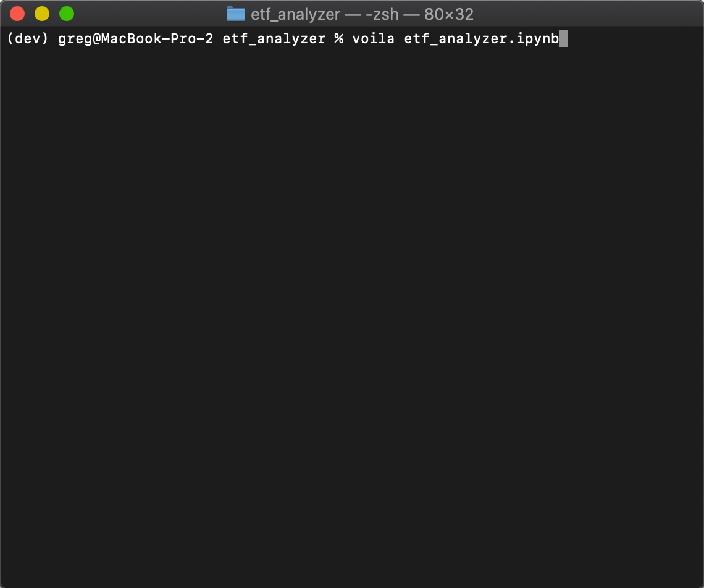

# ETF Analyzer Application

This project includes a financial database web application that analyzes the performance of a hypothetical fintech (Financial Technology) ETF (Exchange Traded Fund).

## Technologies

* Python interpreter v3.9.12
* Python Pandas library: Data analysis and manipulation tools
* Python NumPy library: Support for working with numerical data
* Python hvPlot library: A high-level plotting API for Python
* Python dotenv library: Support for using secure environment variables
* SQL database: Storage of the underlying financial data
* Python Voilà library: Support for rendering Python applications in a web interface

## Pre-Requisites

This application requires the SQLite database (already installed with Python/Conda), the SQLAlchemy ORM (Object Relational Mapper) and the Voila library. Follow these instructions to install the required support:

With your Conda dev environment active, run the following command to install SQLAlchemy:

```pip install SQLAlchemy```

Run the following command to install the Voila library:

```conda install -c conda-forge voila```

## Usage
To use this application, simply clone the repository and open the etf_analyzer.ipynb script in the Jupyter Lab application.

```etf_analyzer.ipynb```

To run as a web application, from your terminal, enter:

```voila etf_analyzer.ipynb```




[](https://www.youtube.com/watch?v=YOUTUBE_VIDEO_ID_HERE)

## License

The source code for the application is licensed under the MIT license, which you can find in the LICENSE file in this repo.
